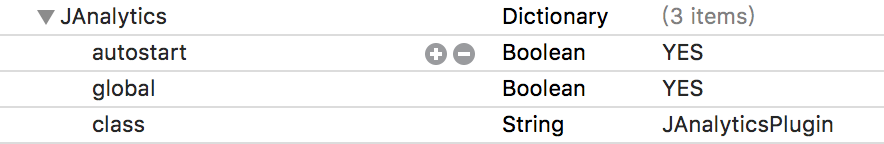

# JAnalytics HBuilder Demo

### iOS 集成

- 将 [JAnalytics_Plugin](./iOS/JAnalytics_Plugin) 文件夹拖到自己的工程里，拖拽的时候选择 create groups【注意：如果已经集成过 JPush 插件需要将 jcore-x.x.x.a 文件删除，不然会出现代码重复错误】。

- 在 [JAnalytics_Plugin/JAnalyticsConfig.plist](./iOS/JAnalytics_Plugin/JAnalyticsConfig.plist) 中配置 APP_KEY。

- 将 [janalytics.js](./janalytics.js) 复制到 Pandora/apps/HelloH5/www/js/ 目录中。

- 在需要用到统计的地方导入 janalytics.js 文件。

- 配置 feature.plist ，在 Xcode 中打开 ../PandoraApi.bundle/ 目录下的 feature.plist ，为插件添加新的 item：

  

- 打开 xcode，点击工程目录中顶部的 工程，选择(Target -> Build Phases -> Link Binary With Libraries)，添加以下 framework 依赖：

  - UIKit
  - SystemConfiguration
  - CoreTelephony
  - CoreGraphics
  - Security
  - Foundation
  - CoreLocation
  - CoreFoundation
  - CFNetwork
  - libz.tbd（libz.dylib）
  - libresolv.tbd

  ### API

  iOS、Android 详细 API 文档请参阅 [janalytics.js 的注释](./janalytics.js)。

